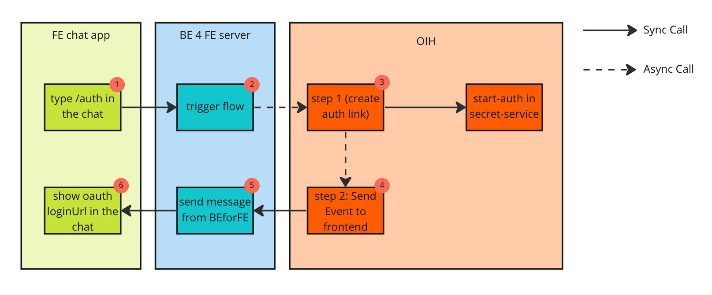

# Simple chat (realtime) with reactjs and websocket to test OIH

To test some workflows with [OIH](https://openintegrationhub.github.io/)

This chat includes a series of slash-commands that trigger OIH flows and receive the results of this flows in a callback that an ending component (not included here would call).

In this POC we would like to integrate a FE application with OIH platform

## Flow of information

OIH Integrations are executed in Flows containing a series of steps executed within Components comminucating via messages using RabbitMQ. The goal was then evaluating how 
feasible and easy would be have user interations expressed in a "synchronous" manner using an async platform in the back.

A example for how this would work can be seen in the following diagram:



1. The user types /auth in the chat. This will send a message via WS to the [backend](./server/)
2. The server will trigger the flow (defined [here](./docs/flow-definition.json)) by calling the [webhooks service](https://openintegrationhub.github.io/docs/5%20-%20Services/Webhooks.html)
3. The webhooks service (collaborating with other OIH services) will trigger the first step of the process asynchronously
4. In this step a **synchronous** call will be done to the auth-service to start an auth-flow and pass the resulting authUrl to the next step in an async mode
5. This step will make a call to the BE server with the result of the previous step (create auth link)
6. The BE will send (via WS) to the frontend the oauth login Url


We have developed and defined some OIH components:

* A [new trigger](https://github.com/bmjuan/oih-dummy-test/blob/0e9abaf1c34e84df3ee4eb5e7ff5b15ba9433aee/component.json#L22) image was deployed by us allowing to run an oauth flow against the secret service
* A [new action](https://github.com/bmjuan/oih-dummy-test/blob/0e9abaf1c34e84df3ee4eb5e7ff5b15ba9433aee/component.json#L32) image was deployed to send the result of the flow to the FE
* The [component implementing this trigger and action](https://github.com/bmjuan/oih-dummy-test) was registered in the OIH platform. You can see the example definition for them [here](./docs/component-definition.json).
* A new flow was defined in the OIH. You can see an example fo the definition [here](./docs/flow-definition.json).

THere are other flows and components defined for the /me command. See [docs](.docs) folder for more info. Here you can find the rerpository for the ms-connector: https://github.com/bmjuan/ms-office-adapter

## Available commands

- /auth: triggers an auth flow
- /me: returns your profile data from MS graph api
- /run-flow <flow-id>: runs an specific OIH Flow id


## Development

```bash

# install yarn (in directory)
$ yarn install

# serve with hot reload at localhost:3000
$ yarn start_client

# build for production and launch server
$ USER_TOKEN=<mi_bearer_token> yarn start_server

# generate static project
$ yarn generate
```
